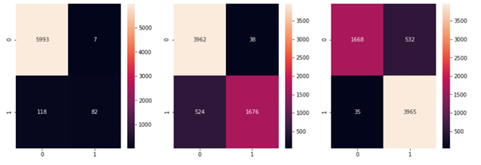

# Assignment-5
# Detecting COVID-19 from X-Rays

This repository contains code and results for COVID-19 classification assignment by Deep Learning Spring 2020 course offered at Information Technology University, Lahore, Pakistan. This assignment is only for learning purposes and is not intended to be used for clinical purposes.

# Part-2

## Task-1: Without Focal Loss

For both pre-trained networks, I used the following parameters:
Epochs = 10

optimizer = optim.SGD(vgg16.parameters(), lr=0.001, momentum=0.9)

### 1.	VGG-16:
Accuracy of the network on the training images came out to be 90 %.
Accuracy of the network on the validation images came out to be 92 %.

Confusion matrices in the order Covid-19, Pneumonia, and Normal are shown below:

 

 

### 2.	ResNet-18:
Accuracy of the network on the training images came out to be 90 %.
Accuracy of the network on the validation images came out to be 92 %.

Confusion matrices in the order Covid-19, Pneumonia, and Normal are shown below:

 

 
## Task-2: With Focal Loss 

In this task, for both pre-trained networks, I used the following parameters:
Epochs = 10

optimizer = optim.SGD(vgg16.parameters(), lr=0.001, momentum=0.9)

### 1.	VGG-16:
Accuracy of the network on the training images came out to be 92 %.
Accuracy of the network on the validation images came out to be 94 %.

Confusion matrices in the order Covid-19, Pneumonia, and Normal are shown below:

 

### 2.	ResNet-18:
Accuracy of the network on the training images came out to be 90 %.
Accuracy of the network on the validation images came out to be 93 %.

Confusion matrices in the order Covid-19, Pneumonia, and Normal are shown below:
 

_________________________________________________________________________________________
# Part-1

# Task-1: Fine-Tuning FC Layers
For both pre-trained networks, I used the following parameters:
Epochs = 10
criterion = nn.CrossEntropyLoss()
optimizer = optim.SGD(vgg16.parameters(), lr=0.001, momentum=0.9)

 # 1.	VGG-16:
Accuracy of the network on the 10000 test images came out to be 97 %.
The confusion matrices of training, testing and validation are given below:
Confusion matrix for training
tensor([[2315., 1999.],
    		   [3310., 2876.]])

Confusion matrix for testing
tensor([[276., 254.],
    		   [429., 357.]])

Confusion matrix for training
tensor([[286., 262.],
        [419., 349.]])

# 2.	ResNet-18:
Accuracy of the ResNet-18 network on the 10000 test images came out to be 41 % which was quite low as compared to VGG-16.
The confusion matrices of training, testing and validation are given below:
Confusion matrix for training
tensor([[4289.,    0.],
[6211.,    0.]])

Confusion matrix for testing
tensor([[548.,   0.],
        		[768.,   0.]])

Confusion matrix for training
tensor([[536.,   0.],
        	[780.,   0.]])

 
# Task-2: Fine-Tuning CNN and FC Layers
In this task, for both pre-trained networks, I used the following parameters:
Epochs = 8
criterion = nn.CrossEntropyLoss()
optimizer = optim.SGD(vgg16.parameters(), lr=0.003, momentum=0.9)

# 1.	VGG-16:
Accuracy of the network on the 10000 test images came out to be 97 %.
The confusion matrices of training, testing and validation are given below:
Confusion matrix for training
tensor([[1719., 2576.],
        		[2406., 3799.]])

Confusion matrix for testing
tensor([[208., 331.],
        		[309., 468.]])

Confusion matrix for training
tensor([[199., 340.],
        	[318., 459.]])

# 2.	ResNet-18:
Accuracy of the ResNet-18 network on the 10000 test images came out to be 41 % which was quite low as compared to VGG-16.
The confusion matrices of training, testing and validation are given below:
Confusion matrix for training
tensor([[4289.,    0.],
[6211.,    0.]])

Confusion matrix for testing
tensor([[548.,   0.],
        		[768.,   0.]])

Confusion matrix for training
tensor([[536.,   0.],
        	[780.,   0.]])

